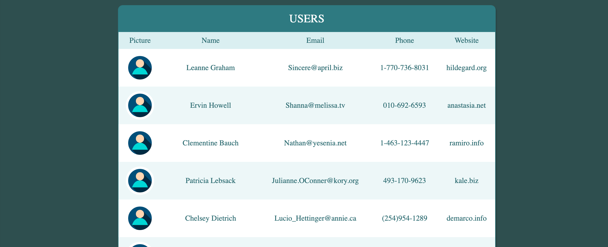

## Users list test project




### Link to the project: https://adzhigitovruslan.github.io/users-list/

## Description

Test project for frontend developer position

## Tech stack

- Vue2
- scss
- vue-router
- vuex
- vue-carousel
- vue-lazyload
- vue-toastification

## Project setup
```
npm install
```

### Compiles and hot-reloads for development
```
npm run serve
```

### Compiles and minifies for production
```
npm run build
```

### Lints and fixes files
```
npm run lint
```

### Customize configuration
See [Configuration Reference](https://cli.vuejs.org/config/).
